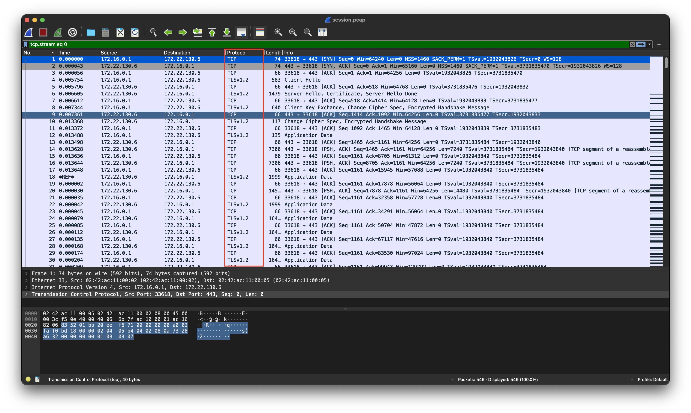
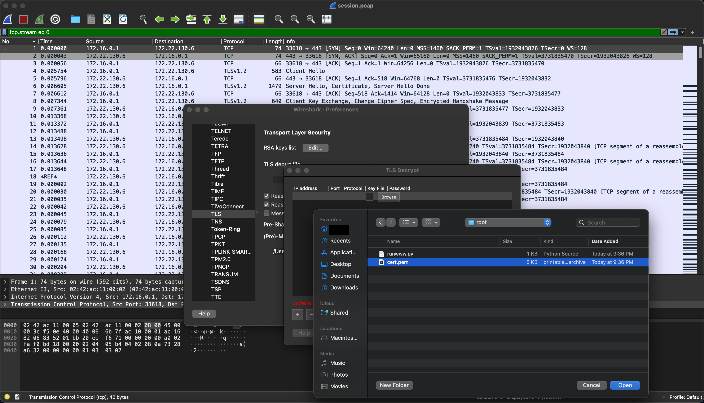
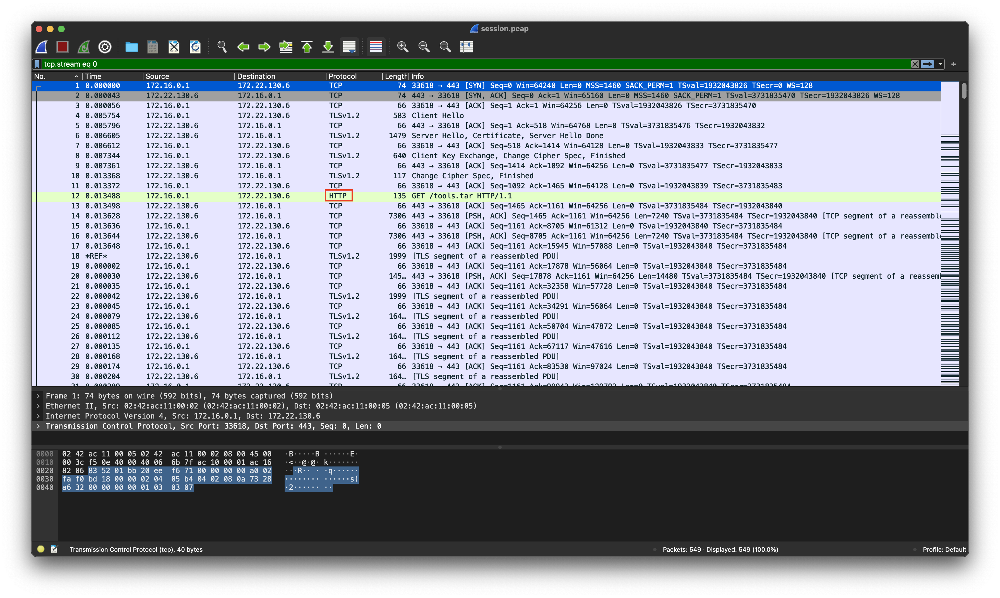
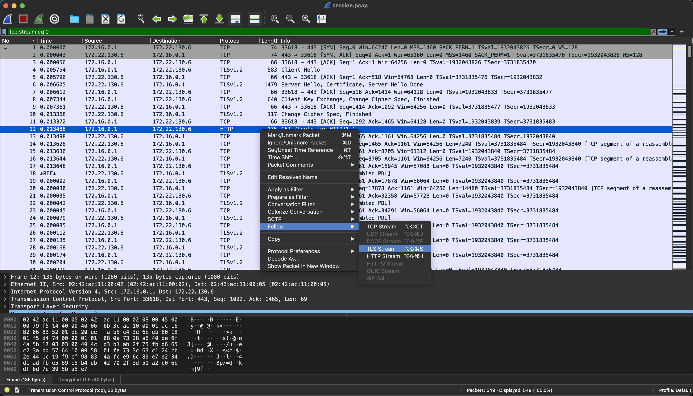
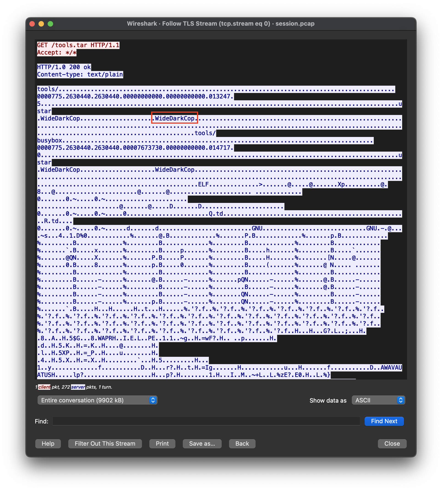

# Task A2 Write-up
```
Using the timestamp and IP address information from the VPN log, the FBI was able to identify a virtual server that the attacker used for staging their attack. They were able to obtain a warrant to search the server, but key files used in the attack were deleted.

Luckily, the company uses an intrusion detection system which stores packet logs. They were able to find an SSL session going to the staging server, and believe it may have been the attacker transferring over their tools.

The FBI hopes that these tools may provide a clue to the attacker's identity
```

Materials given include `root.tar.bz2` which contains the contents of the root users home directory. Also given is `session.pcap`, a wireless capture file which we may analyze in Wireshark.
First thing first, we should extract the root directory to see what's in store:
```
domlord in ~/hacking/codebreaker-2022/taskA2  bzip2 -d root.tar.bz2
domlord in ~/hacking/codebreaker-2022/taskA2  tar xvf root.tar
domlord in ~/hacking/codebreaker-2022/taskA2  cd root
domlord in ~/hacking/codebreaker-2022/taskA2/root  ls -la
total 48
drwx------@ 10 domlord  staff   320 Dec 31  1969 .
drwxr-xr-x   6 domlord  staff   192 Aug 29 21:36 ..
-rw-------@  1 domlord  staff   123 Dec 31  1969 .bash_history
-rwxr-xr-x@  1 domlord  staff  3106 Dec 31  1969 .bashrc
drwxr-xr-x@  3 domlord  staff    96 Dec 31  1969 .cache
-rw-------@  1 domlord  staff  5086 Dec 31  1969 .cert.pem
drwx------@  4 domlord  staff   128 Dec 31  1969 .local
-rwxr-xr-x@  1 domlord  staff   148 Dec 31  1969 .profile
drwx------@  3 domlord  staff    96 Dec 31  1969 .ssh
-rwxr-xr-x@  1 domlord  staff  1308 Dec 31  1969 runwww.py
domlord in ~/hacking/codebreaker-2022/taskA2 
```

As we can see, there exists a python script. This is likely what the attacker used to download their toolkit. Also, one should note the suspicious `.cert.pem` file, as this doesn't typically exist in a home directory.

```
domlord in ~/hacking/codebreaker-2022/taskA2/root  cat runwww.py
#!/usr/bin/env python3

# This script will create an anonymous, secure, temporary web server to transfer files over HTTPS.

import argparse
import datetime
import os
import random
import string
import subprocess
import sys

try:
    import libfaketime
except ImportError:
    subprocess.run(f'{sys.executable} -m pip install --user libfaketime', shell=True)
    import libfaketime


p = argparse.ArgumentParser()
p.add_argument('port', type=int)
args = p.parse_args()

certfile = '.cert.pem'
randoff = datetime.timedelta(seconds=random.randrange(3 * 365 * 24 * 3600))
dt = datetime.datetime.strptime('2017-01-01 00:00:00', '%Y-%m-%d %H:%M:%S') + randoff
env = libfaketime.get_reload_information()[1]
env['FAKETIME'] = dt.strftime('%Y-%m-%d %H:%M:%S')
cn = ''.join(c for c in random.choices(string.ascii_lowercase, k=12))
subprocess.run(
    f'openssl req -x509 -out {certfile} -new -keyout {certfile} -newkey rsa:4096 -batch -nodes -subj /CN={cn} -days 3650',
    env=env,
    stderr=subprocess.DEVNULL,
    check=True,
    shell=True)
subprocess.run(f'openssl x509 -noout -text -in {certfile}', shell=True)
print(f'Running openssl HTTPS server on port {args.port}')
os.execlp('openssl', 'openssl', 's_server', '-accept', str(args.port), '-cert', certfile, '-tls1_2', '-cipher', 'AES256-GCM-SHA384', '-WWW')
```

Ah, so the python script confirms our suspicion! `certfile = '.cert.pem'` tells us that our certfile was in fact used to download something.
```
os.execlp('openssl', 'openssl', 's_server', '-accept', str(args.port), '-cert', certfile, '-tls1_2', '-cipher', 'AES256-GCM-SHA384', '-WWW')
```

This line in particular shows us that `openssl` was used as the server to download something.
Now we can analyze the session capture.



Here we can see that the traffic is encrypted with `TLSv1.2` encryption. However, from our analysis we have the certificate used to encrypt the traffic!
So, using Wireshark we can decrypt the traffic:
```
domlord in ~/hacking/codebreaker-2022/taskA2/root  mv .cert.pem cert.pem
```

In Wireshark, go to `Preferences->Protocols->TLS->RSA keys list->Key File` and then add your `cert.pem` file:



Now you should see a decrypted TLS packet:



Simply follow this stream:



And we have our username!



