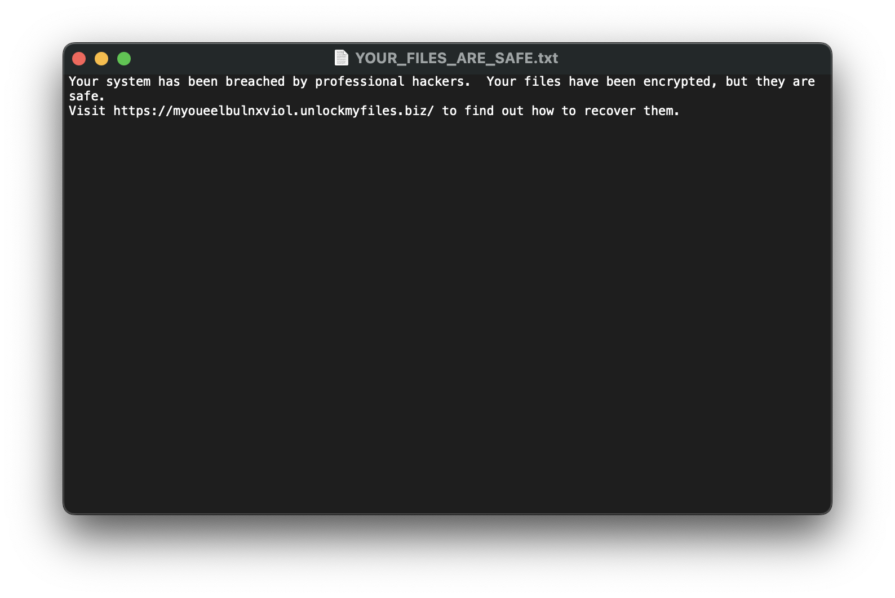
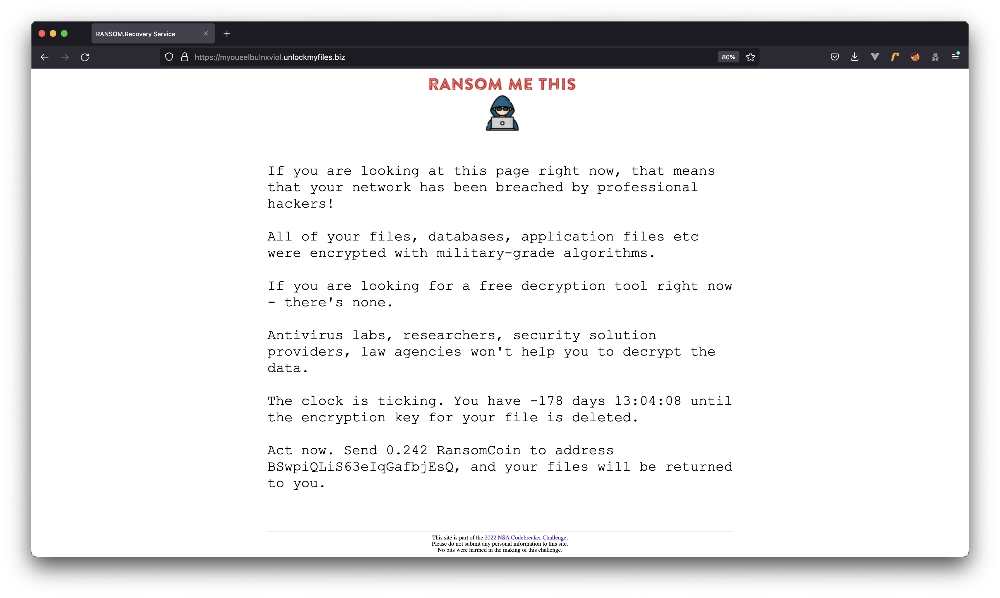
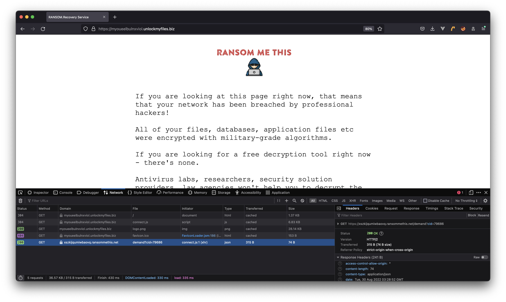

# Task B1 Write-Up
```
The attacker left a file with a ransom demand, which points to a site where they're demanding payment to release the victim's files.

We suspect that the attacker may not have been acting entirely on their own. There may be a connection between the attacker and a larger ransomware-as-a-service ring.

Analyze the demand site, and see if you can find a connection to another ransomware-related site.
```

This one wasn't too hard, it was just easy to get distracted!

We're given the following ransom note:



Which leads us to their website:



We're supposed to see if this website is *related* to any other websites, so it would make sense to check the connections it makes when loading the page.
The metadata about the attack might come from an external source:



And behold, we see another URL which this website connects to. One rabbit hole to go down is looking at the Javascript first. It is highly obfuscated and very difficult to work backwards from.
But at the end, we arrive at the answer regardless:

```xszkijqumiwbaovq.ransommethis.net```

