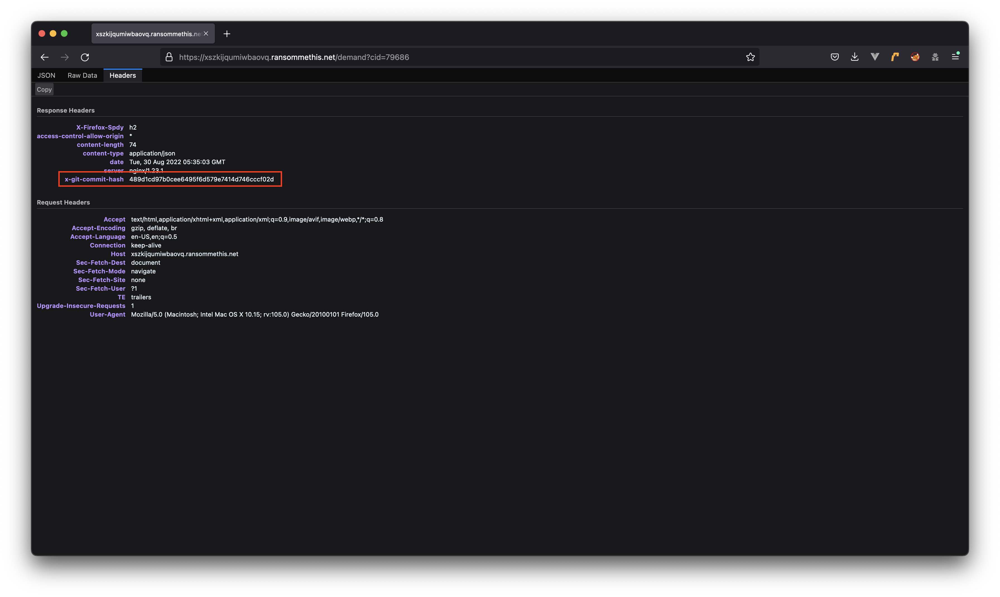
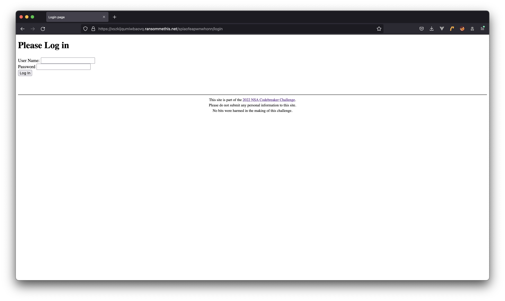

# Task B2 Write-Up
<pre>
It looks like the backend site you discovered has some security features to prevent you from snooping. They must have hidden the login page away somewhere hard to guess.

Analyze the backend site, and find the URL to the login page.

<i>*Hint: this group seems a bit sloppy. They might be exposing more than they intend to.</i>
</pre>

We're tasked with finding a login page for this Ransomware-as-a-Service website, however there should be something noticable that gives us access.

This challenge starts with us accessing the URL we found in the `taskB1`.
The URL we got from the previous challenge also accessed a route on the target like so:
```
/demand?cid=79686
```

Once we access this endpoint, we see that it returns JSON data:


With Firefox, it is easy to also check the Headers of the request:



From this we can see that the server is sending us a `x-git-commit-hash` header, which suggests that the git version history is public. We can verify this by checking to see whether git information exists:


It does! Now it comes down to scraping the `.git` metadata directory and rebuilding the repository associated with the server. Unfortunately, directory listing is disabled, which means we must systematically scan the directory for files. While we could use a pre-built tool for this, I'd rather refresh myself on Git systems and relearn the info available. Here is a summary of the information I gathered:

 - The `.git` directory holds the meat of your local repo. It holds subdirectories for `objects`, `refs`, `config`, `index`, `HEAD`, and more.
 - The `objects` folder is where the three objects: `commit`, `tree` and `blob` are housed. Each object gets its own sub folder.
 - The `refs` folder holds references to all of the objects in the directory. 
 - The `config` folder contains all of your configurations including the credentials you use to connect to GitHub; your email and name that you used to configure your global config.
 - The `HEAD` file is what contains the pointer or reference to your working directory or branch and its latest commit.
 - The `index` file is for when you use `git add` to stage your files for a commit. They leave the `index` file after the commit.

So it would be good to download the `HEAD`, `config`, and `index` files to see what they hold.
However, note that the `index` file has it's own binary format, so I used a tool call `gin` to parse it. Also, the `index` file is pretty long so I omitted some information:

```
domlord in ~/hacking/codebreaker-2022/taskB2/.git on main  cat HEAD
ref: refs/heads/main
domlord in ~/hacking/codebreaker-2022/taskB2/.git on main  cat config
[core]
	repositoryformatversion = 0
	filemode = true
	bare = false
	logallrefupdates = true
domlord in ~/hacking/codebreaker-2022/taskB2/.git on main  gin ./index
[header]
  signature = DIRC
  version = 2
  entries = 19

[entry]
...
  sha1 = fc46c46e55ad48869f4b91c2ec8756e92cc01057
  name = Dockerfile
...

[entry]
...
  sha1 = dd5520ca788a63f9ac7356a4b06bd01ef708a196
  name = Pipfile
...

[entry]
...
  sha1 = 47709845a9b086333ee3f470a102befdd91f548a
  name = Pipfile.lock
...

[entry]
...
  sha1 = e69de29bb2d1d6434b8b29ae775ad8c2e48c5391
  name = app/__init__.py
...

[entry]
...
  sha1 = d764bf6d4676a96e573e8119960eefea7688f8a3
  name = app/server.py
...

[entry]
...
  sha1 = a844f894a3ab80a4850252a81d71524f53f6a384
  name = app/templates/404.html
...

[entry]
...
  sha1 = 1df0934819e5dcf59ddf7533f9dc6628f7cdcd25
  name = app/templates/admin.html
...

[entry]
...
  sha1 = b9cfd98da0ac95115b1e68967504bd25bd90dc5c
  name = app/templates/admininvalid.html
...

[entry]
...
  sha1 = bb830d20f197ee12c20e2e9f75a71e677c983fcd
  name = app/templates/adminlist.html
...

[entry]
...
  sha1 = 5033b3048b6f351df164bae9c7760c32ee7bc00f
  name = app/templates/base.html
...

[entry]
...
  sha1 = 10917973126c691eae343b530a5b34df28d18b4f
  name = app/templates/forum.html
...

[entry]
...
  sha1 = fe3dcf0ca99da401e093ca614e9dcfc257276530
  name = app/templates/home.html
...

[entry]
...
  sha1 = 779717af2447e24285059c91854bc61e82f6efa8
  name = app/templates/lock.html
...

[entry]
...
  sha1 = 0556cd1e1f584ff5182bbe6b652873c89f4ccf23
  name = app/templates/login.html
...

[entry]
...
  sha1 = 56e0fe4a885b1e4eb66cda5a48ccdb85180c5eb3
  name = app/templates/navbar.html
...

[entry]
...
  sha1 = ed1f5ed5bc5c8655d40da77a6cfbaed9d2a1e7fe
  name = app/templates/unauthorized.html
...

[entry]
...
  sha1 = c980bf6f5591c4ad404088a6004b69c412f0fb8f
  name = app/templates/unlock.html
...

[entry]
...
  sha1 = 470d7db1c7dcfa3f36b0a16f2a9eec2aa124407a
  name = app/templates/userinfo.html
...

[entry]
...
  sha1 = eb99fcf157d744ab8ba521de3fa4c5f9f9f9dedd
  name = app/util.py
...

[checksum]
  checksum = True
  sha1 = ea0f7125f675190bb757026129866356df2cf840

```

Also, after taking a look at a sample repository I created on my local machine, I noticed that the `info` directory only had one file in it, which was a file called `exclude`, so I downloaded that as well:
```
domlord in ~/hacking/codebreaker-2022/taskB2/.git on main  cat info/exclude
# git ls-files --others --exclude-from=.git/info/exclude
# Lines that start with '#' are comments.
# For a project mostly in C, the following would be a good set of
# exclude patterns (uncomment them if you want to use them):
# *.[oa]
# *~
```

The same thing follows for the `logs` directory:
```
domlord in ~/hacking/codebreaker-2022/taskB2/.git on main  ls logs/
HEAD refs
domlord in ~/hacking/codebreaker-2022/taskB2/.git on main  cat logs/HEAD
0000000000000000000000000000000000000000 489d1cd97b0cee6495f6d579e7414d746cccf02d Ransom Me This <root@ransommethis.net> 1659568019 +0000	commit (initial): Initial import
489d1cd97b0cee6495f6d579e7414d746cccf02d 0000000000000000000000000000000000000000 Ransom Me This <root@ransommethis.net> 1659568019 +0000	Branch: renamed refs/heads/master to refs/heads/main
0000000000000000000000000000000000000000 489d1cd97b0cee6495f6d579e7414d746cccf02d Ransom Me This <root@ransommethis.net> 1659568019 +0000	Branch: renamed refs/heads/master to refs/heads/main
domlord in ~/hacking/codebreaker-2022/taskB2/.git on main  ls logs/refs
heads
domlord in ~/hacking/codebreaker-2022/taskB2/.git on main  ls logs/refs/heads
main
domlord in ~/hacking/codebreaker-2022/taskB2/.git on main  cat logs/refs/heads/main
0000000000000000000000000000000000000000 489d1cd97b0cee6495f6d579e7414d746cccf02d Ransom Me This <root@ransommethis.net> 1659568019 +0000	commit (initial): Initial import
489d1cd97b0cee6495f6d579e7414d746cccf02d 489d1cd97b0cee6495f6d579e7414d746cccf02d Ransom Me This <root@ransommethis.net> 1659568019 +0000	Branch: renamed refs/heads/master to refs/heads/main
```

There I was able to determine the branch name from the `logs/HEAD` file harvested.

At this point I started looking in the `refs` directory. Looking at a local model I had created, I found the associated files on the website and downloaded them:
```
domlord in ~/hacking/codebreaker-2022/taskB2/.git on main  ls refs
heads
domlord in ~/hacking/codebreaker-2022/taskB2/.git on main  ls refs/heads/
main
domlord in ~/hacking/codebreaker-2022/taskB2/.git on main  cat refs/heads/main
489d1cd97b0cee6495f6d579e7414d746cccf02d
```

This hash is important! A keen eye will see that it is the same hash we recieved in the `x-git-commit-hash` header from the webserver. That means this is the current commit hash of the `main` branch of this repository. Using this hash, as well as the others we found earlier in the `index` file, we can start grabbing items from the `objects` directory!

The way the objects directory works is that it takes the first two characters from the objects hash and creates a directory. Then inside that directory, it uses the rest of the hash as a file name for the object. Here is an example:
```
domlord in ~/hacking/codebreaker-2022/taskB2/.git on main  ls -l objects
drwxr-xr-x  3 domlord  staff   96 Aug 15 22:40 48
domlord in ~/hacking/codebreaker-2022/taskB2/.git on main  ls -l objects/48
total 8
-rw-r--r--  1 domlord  staff  141 Aug  3 18:06 9d1cd97b0cee6495f6d579e7414d746cccf02d
domlord in ~/hacking/codebreaker-2022/taskB2/.git on main  cat objects/48/9d1cd97b0cee6495f6d579e7414d746cccf02d
[redacted binary gobbly-gook]
```

But the original hash was `489d1cd97b0cee6495f6d579e7414d746cccf02d`!
Now all that's necessary is taking the remaining SHA1 hashes from the `index` file and repeating the process! It's not to hard to write a script for that at this point.
Once you have rebuilt the git working tree, you should be able to run a `git status` and check out the status of the repository. `git` will realize all of the files have been deleted and want you to stage these changes if you think they are correct. What you should actually do to revert this is `git restore .` and all of the working tree items will be recovered:
```
domlord in ~/hacking/codebreaker-2022/taskB2 on main  tree .
.
├── Dockerfile
├── Pipfile
├── Pipfile.lock
└── app
    ├── __init__.py
    ├── server.py
    ├── templates
    │   ├── 404.html
    │   ├── admin.html
    │   ├── admininvalid.html
    │   ├── adminlist.html
    │   ├── base.html
    │   ├── forum.html
    │   ├── home.html
    │   ├── lock.html
    │   ├── login.html
    │   ├── navbar.html
    │   ├── unauthorized.html
    │   ├── unlock.html
    │   └── userinfo.html
    └── util.py

2 directories, 19 files
```

Now we have all of the server code. I'd go about explaining what all of the files do, but at the time of writing it is too late for that. I will simply include a copy of the code in this folder of the write-up.

The only necessary information is these tidbits from `app/server.py`:
```
def expected_pathkey():
	return "spiaofeapwnwhonn"

...

@app.route("/", defaults={'pathkey': '', 'path': ''}, methods=['GET', 'POST'])
@app.route("/<path:pathkey>", defaults={'path': ''}, methods=['GET', 'POST'])
@app.route("/<path:pathkey>/<path:path>", methods=['GET', 'POST'])
def pathkey_route(pathkey, path):
	if pathkey.endswith('/'):
		# Deal with weird normalization
		pathkey = pathkey[:-1]
		path = '/' + path

	# Super secret path that no one will ever guess!
	if pathkey != expected_pathkey():
		return render_template('unauthorized.html'), 403
	# Allow access to the login page, even if they're not logged in
	if path == 'login':
		return loginpage()
	# Check if they're logged in.
	try:
		uid = util.get_uid()
	except util.InvalidTokenException:
		return redirect(f"/{pathkey}/login", 302)

	# At this point, they have a valid login token
	if path == "":
		return redirect(f"/{pathkey}/", 302)
	elif path == "/" or path == 'home':
		return navpage()
	elif path == 'adminlist':
		return adminlist()
	elif path == 'userinfo':
		return userinfo()
	elif path == 'forum':
		return forum()
	elif path == 'lock':
		return lock()
	elif path == 'unlock':
		return unlock()
	# Admin only functions beyond this point
	elif path == 'admin':
		return util.check_admin(admin)
	elif path == 'fetchlog':
		return util.check_admin(fetchlog)
	elif path == 'credit':
		return util.check_admin(credit)
	# Default
	return render_template('404.html'), 404
```

Here we can see that everything is simply hidden in a pseudo-directory-like-thing! Nice. If we add this to the URL:



So that is our URL!

